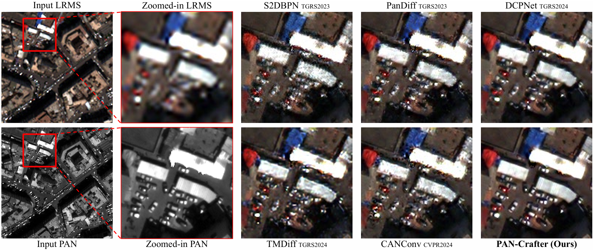
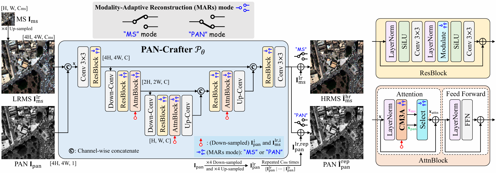

<div align="center">
<h2>[ICCV 2025] PAN-Crafter: Learning Modality-Consistent Alignment for PAN-Sharpening</h2>

<div>    
    <a href='https://sites.google.com/view/jeonghyeokdo/' target='_blank'>Jeonghyeok Do</a><sup>1</sup>&nbsp&nbsp&nbsp&nbsp;
    <a href='https://github.com/KAIST-VICLab/' target='_blank'>Sungpyo Kim</a><sup>1</sup>&nbsp&nbsp&nbsp&nbsp;
    <a href='https://sites.google.com/view/geunhyukyouk/' target='_blank'>Geunhyuk Youk</a><sup>1</sup>&nbsp&nbsp&nbsp&nbsp;
    <a href='https://sites.google.com/view/jaehyup-lee/' target='_blank'>Jaehyup Lee</a><sup>2†</sup>&nbsp&nbsp&nbsp&nbsp;
    <a href='https://www.viclab.kaist.ac.kr/' target='_blank'>Munchurl Kim</a><sup>1†</sup>
</div>
<br>
<div>
    <sup>†</sup>Co-corresponding authors</span>
</div>
<div>
    <sup>1</sup>Korea Advanced Institute of Science and Technology, South Korea</span>
</div>
<div>
    <sup>2</sup>Kyungpook National University, South Korea</span>
</div>

<div>
    <h4 align="center">
        <a href="https://kaist-viclab.github.io/PAN-Crafter_site/" target='_blank'>
        
        </a>
        <a href="https://arxiv.org/abs/2505.23367" target='_blank'>
        
        </a>
        <a href="https://youtu.be/kQeZz6X5ag8" target='_blank'>
        
        </a>
        <a href="https://drive.google.com/file/d/1MySS-KZ2GB6c1VgpYziVicgSPeG56NYC/view?usp=drive_link" target='_blank'>
            
        </a>
        
    </h4>
</div>
</div>

---

<h4>
This repository is the official PyTorch implementation of "PAN-Crafter: Learning Modality-Consistent Alignment for PAN-Sharpening". PAN-Crafter achieves state-of-the-art results on multiple datasets, outperforming the recent PAN-Sharpening methods.
</h4>



## Network Architecture


---

## 📧 News
- **Jul 26, 2025:** Youtube video about PAN-Crafter is uploaded :sparkles:
- **Jul 18, 2025:** Codes of PAN-Crafter are released :fire:
- **Jun 26, 2025:** PAN-Crafter accepted to ICCV 2025 :tada:
- **May 30, 2025:** This repository is created

---
## Reference
```BibTeX
@inproceedings{do2025pancrafter,
  title={PAN-Crafter: Learning Modality-Consistent Alignment for PAN-Sharpening},
  author={Do, Jeonghyeok, Kim, Sungpyo, Youk, Geunhyuk, Lee, Jaehyup, and Kim, Munchurl},
  booktitle={Proceedings of the IEEE/CVF international conference on computer vision},
  year={2025}
}
```
---

## Contents
- [Requirements](#requirements)
- [Data Preparation](#data-preparation)
- [Training](#training)
- [Results](#results)
- [License](#license)
- [Acknowledgement](#acknowledgement)

## ⚙️ Requirements
> - Python >= 3.9.19
> - PyTorch >= 2.4.0
> - Platforms: Ubuntu 22.04, CUDA 11.8
> - We have included a dependency file for our experimental environment. To install all dependencies, create a new Anaconda virtual environment and execute the provided file. Run `conda env create -f requirements.yaml`.

## 📁 Data Preparation

### Pancollection Dataset

We follow the evaluation setup from [PanCollection](https://github.com/liangjiandeng/PanCollection).

Download the datasets [here](https://github.com/liangjiandeng/PanCollection) and arrange them as follows:
```bash
Pancollection
    ├── WV3
    │   ├── train_wv3.h5
    │   ├── valid_wv3.h5
    │   ├── train_wv3_pan.h5
    │   ├── valid_wv3_pan.h5
    │   ├── reduced_examples_h5
    │   │   ├── test_wv3_multiExm1.h5
    │   │   └── test_wv3_multiExm1_pan.h5
    │   └─── full_examples_h5
    │       ├── test_wv3_OrigScale_multiExm1.h5
    │       └── test_wv3_OrigScale_multiExm1_pan.h5
    │
    ├── QB
    │   ├── train_qb.h5
    │   ├── valid_qb.h5
    │   ├── train_qb_pan.h5
    │   ├── valid_qb_pan.h5
    │   ├── reduced_examples_h5
    │   │   ├── test_qb_multiExm1.h5
    │   │   └── test_qb_multiExm1_pan.h5
    │   └─── full_examples_h5
    │       ├── test_qb_OrigScale_multiExm1.h5
    │       └── test_qb_OrigScale_multiExm1_pan.h5
    │
    └── GF2
        ├── train_gf2.h5
        ├── valid_gf2.h5
        ├── train_gf2_pan.h5
        ├── valid_gf2_pan.h5
        ├── reduced_examples_h5
        │   ├── test_gf2_multiExm1.h5
        │   └── test_gf2_multiExm1_pan.h5
        └─── full_examples_h5
            ├── test_gf2_OrigScale_multiExm1.h5
            └── test_gf2_OrigScale_multiExm1_pan.h5
```
> **Note:** Files with `_pan.h5` (e.g., `train_wv3_pan.h5`, `test_qb_multiExm1_pan.h5`) contain the panchromatic image \(I_{pan}^{lr}\),  
> which has been down-sampled by a factor of 4 to match the spatial resolution of the multispectral image \(I_{ms}^{lr}\).

## Training
```bash
# Download code
git clone https://github.com/KAIST-VICLab/PAN-Crafter
cd PAN-Crafter

# Train PAN-Crafter on WV3
python main.py --config ./config/pancrafter_wv3.yaml

# Train PAN-Crafter on QB
python main.py --config ./config/pancrafter_qb.yaml

# Train PAN-Crafter on GF2
python main.py --config ./config/pancrafter_gf2.yaml
```

## Results
Please visit our [project page](https://kaist-viclab.github.io/PAN-Crafter_site/) for more experimental results.

> All evaluation metrics were measured using the official MATLAB code from the [DLPan-Toolbox](https://github.com/liangjiandeng/DLPan-Toolbox).

## License
The source codes can be freely used for research and education only. Any commercial use should get formal permission from the principal investigator (Prof. Munchurl Kim, mkimee@kaist.ac.kr).

## Acknowledgements
This work was supported by National Research Foundation of Korea (NRF) grant funded by the Korean Government [Ministry of Science and ICT (Information and Communications Technology)] (Project Number: RS- 2024-00338513, Project Title: AI-based Computer Vision Study for Satellite Image Processing and Analysis, 100%).

This repository is built upon [SkateFormer](https://github.com/KAIST-VICLab/SkateFormer/) and [U-Know-DiffPAN](https://github.com/KAIST-VICLab/U-Know-DiffPAN).